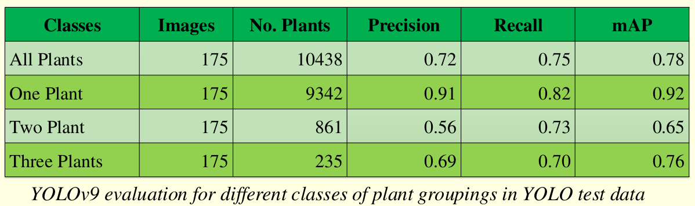

# DeepMaizeCounter(DMC) - Automating Maize Stand Counting with UAV Imagery

## Description
In genetic farming, maize plants are arranged in specific layouts where each row is 20ft long. These rows are organized into groups called ranges, with 4-foot alleys between each range. Each row is planted with different maize lines, and during the seedling stage, accurate stand counting is crucial. Stand counting ensures adequate germination and a sufficient number of candidates for pollination. If the germination rate is low, replanting can be performed early to optimize pollination.

Traditionally, stand counting is a labor-intensive process involving at least two people who count seedlings in silence before agreeing on a final count for each row. This manual approach is both error-prone and time-consuming.

To address this, we developed DeepMaizeCounter(DMC), an automated stand-counting pipeline processing freely-flown videos captured by UAVs. DMC cann process either mosaic images or raw video frames, outputting a count for each row.

## Dependencies both for DMC and YOLOv9
- python 3.8.10 or above
- for cuda, I use cuda-11.8 and cudnn-8.9.5.30
- to install requirement.txt
```
pip install requirement.txt
```


## Clone YOLOv9 code on https://github.com/WongKinYiu/yolov9 and placed it on YOLOv9 directory.
- For detection, we use YOLOv9. However, since they are continuously improving YOLO and publishing newer versions, you can use the latest version, but you will need to retrain the model.
- Our published model is located in the directory yolov9_model.
- The DMC YOLOv9 dataset consists of three classes: one plant, two plants, and three plants.
- The accuracy for one plant is higher compared to two and three plants. This is due to imbalanced training data. Two and three plants are outliers, and we do not often see them in planting. However, these classes are included to improve counting accuracy. See evaluatuion figure below.
- to clone YOLOv9 repository, clone it in the same directory tree as matlab and python directories
```
git clone https://github.com/WongKinYiu/yolov9.git
```

<div align="center">
    <a href="./">
        
    </a>
</div>

## running DMC
DMC has two modes of counting:
### counting from mosaic image
```
template:
python dmc_main.py -image_path /path/to/mosaic.png -save_path path/to/save/dmc/processes -mode mosaic -num_classes int

```

### counting from raw frames
```
template:
python dmc_main.py -image_path /path/to/mosaic.png -save_path path/to/save/dmc/processes -hm path/to/homography/matrices/.csv -mode raw -num_classes int
```

