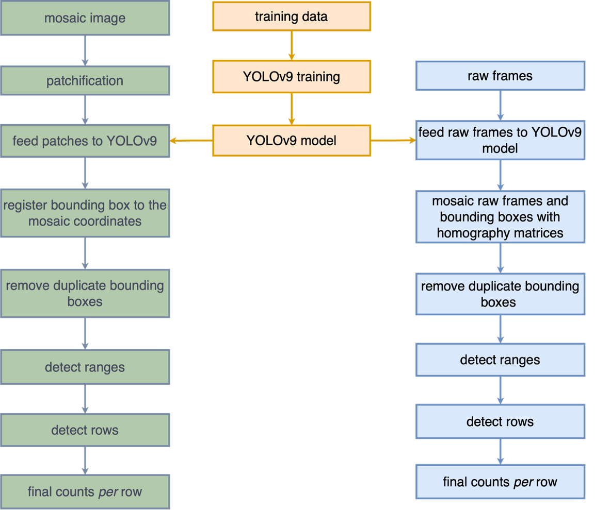

# MaizeStandCounting (MaSC)

**MaizeStandCounting (MaSC)** is an end-to-end pipeline for automated maize seedling stand counting from RGB UAV imagery. MaSC supports two input modes:

1. **Mosaic mode**: large pre-mosaicked RGB images are divided into overlapping patches, processed with YOLOv9, and reconstructed in mosaic coordinates.
2. **Raw frame mode**: individual UAV frames are processed directly with YOLOv9, then detections are projected into a common coordinate system using homography matrices and consolidated across overlapping frames.

Both modes use a YOLOv9 maize seedling detector and spatial range/row analysis to generate row-wise stand counts. In the associated study, raw frame mode achieved an \(R^2\) of 0.906 and an MAE of 1.97 plants per row, compared with an \(R^2\) of 0.616 and an MAE of 4.20 plants per row for mosaic mode.

## Repository setup

The instructions below document the tested Linux setup used to run MaSC.

### 1. Install Miniconda

Install Miniconda for Linux and follow the installer instructions.

Example for Linux x86_64:

```bash
wget https://repo.anaconda.com/miniconda/Miniconda3-latest-Linux-x86_64.sh
bash Miniconda3-latest-Linux-x86_64.sh
```

Restart the shell, or reload the shell configuration after installation.

Verify Conda:

```bash
conda --version
```

### 2. Create the MaSC environment

Create a Conda environment with Python 3.8:

```bash
conda create -n masc_venv python=3.8
```

Activate the environment:

```bash
conda activate masc_venv
```

Verify the Python version:

```bash
python --version
```

Tested version:

```text
Python 3.8.20
```

### 3. Install Python dependencies

Before installing the project dependencies, install packaging-tool versions compatible with this older environment:

```bash
python -m pip install "pip<24" "setuptools<70" wheel
```

Then install the project requirements:

```bash
pip install -r requirement.txt
```

#### Dependency resolution note

The original dependency set contained an incompatible combination:

```text
y-py==0.5.9
jupyter-ydoc==0.2.4
ypy-websocket==0.8.4
```

`jupyter-ydoc==0.2.4` requires `y-py>=0.5.3,<0.6.0`, while `ypy-websocket==0.8.4` requires `y-py>=0.6.0,<0.7.0`.

The working environment uses:

```text
ypy-websocket==0.8.2
```

with:

```text
y-py==0.5.9
jupyter-ydoc==0.2.4
```

After this change:

```bash
pip install -r requirement.txt
```

completed successfully.

No separate build-constraint file was needed for the Python 3.8 environment.

## GPU environment

The installed PyTorch environment was verified with:

```bash
python -c "import torch; print('Torch:', torch.__version__); print('CUDA build:', torch.version.cuda); print('CUDA available:', torch.cuda.is_available()); print('cuDNN:', torch.backends.cudnn.version())"
```

Tested output:

```text
Torch: 1.13.0+cu117
CUDA build: 11.7
CUDA available: True
cuDNN: 8500
```

This corresponds to:

- PyTorch 1.13.0
- CUDA 11.7
- cuDNN 8.5

A separate `module load cuda/...` or `module load cudnn/...` was **not required** for normal YOLOv9 training/inference in this environment because the installed PyTorch stack already provides the required CUDA runtime and cuDNN libraries.

The GPU can be checked with:

```bash
python -c "import torch; print(torch.cuda.get_device_name(0))"
```

## Download data, model, and results

Before running MaSC, download the archived **data, trained model, and results** from Zenodo:

**Zenodo archive:**

https://doi.org/10.5281/zenodo.22219350

Create the expected directories inside the repository:

```bash
mkdir -p data results
```

The local repository should contain at least:

```text
MaizeStandCounting_MaSC/
├── data/
├── yolov9_model/
├── results/
├── requirement.txt
└── README.md
```

Download the files from the Zenodo record and organize them as follows:

- **`data/`**: input imagery and supporting data used by MaSC, including the data required for mosaic/raw-frame processing.
- **`yolov9_model/`**: trained YOLOv9 model weights; the expected weight file is `yolov9_model/best.pt`.
- **`results/`**: archived MaSC outputs and evaluation results.

If the Zenodo files are distributed as compressed archives, extract each archive into its corresponding directory.

For example:

```bash
unzip <data_archive>.zip -d data/
unzip <model_archive>.zip -d yolov9_model/
unzip <results_archive>.zip -d results/
```

The large archived files are hosted on Zenodo rather than duplicated in the GitHub repository.

## MaSC workflow

MaSC processes UAV imagery using either mosaic or raw-frame input.

<div align="center">
  
</div>

The trained detector has three classes: a box classified as class 0, 1, or 2 represents one, two, or three plants, respectively. Consequently, each retained detection contributes `class_id + 1` plants to its assigned row.

### One-time code and model preparation

Run all commands below from the repository root. The repository reserves `yolov9/` for the upstream YOLOv9 source, but does not deposit that third-party source code. Clone it before running detection:

```bash
git clone https://github.com/WongKinYiu/yolov9.git yolov9-source
cp -r yolov9-source/. yolov9/
rm -rf yolov9-source
```

Confirm that the detector and weights are present:

```bash
test -f yolov9/detect.py
test -f yolov9_model/best.pt
```

The `run_yolo_detection()` function in `masc_main.py` retains absolute paths from the original research computer. Before using mosaic mode, replace these two entries in that function:

```python
'python', '/data/e/dmc/code/yolov9/detect.py',
...
'--weights', '/data/e/dmc/code/yolov9/runs/train/yolov9-c17/weights/best.pt',
```

with repository-relative paths:

```python
'python', 'yolov9/detect.py',
...
'--weights', 'yolov9_model/best.pt',
```

Also change `--device` from `0,1` to `0` when only one GPU is available. For CPU inference, use `cpu`; it will be substantially slower.

The commands below use `masc_main.py`, which imports the active implementation from `src/`. The duplicate files under `python/` and the legacy `dmc_main.py` are retained for provenance and are not the recommended entry points.

### Mosaic mode

Mosaic mode accepts one pre-built RGB mosaic. It cuts the image into overlapping patches, detects seedlings in every patch, maps the patch detections back to the original mosaic, removes duplicate boxes, finds field ranges and rows, and produces a count for every row.

#### Inputs

- One readable RGB mosaic in PNG format. The current entry point calls `cv2.imread()` directly; convert TIFF imagery to PNG before running it.
- `yolov9_model/best.pt`.
- An empty or new output directory under `results/`.

#### Step-by-step procedure

1. Locate the deposited mosaic and inspect its dimensions:

   ```bash
   find data -type f \( -iname '*.png' -o -iname '*.tif' -o -iname '*.tiff' \) | sort
   python -c "import cv2; p='data/mosaic_mode/<mosaic>.png'; im=cv2.imread(p); print(p, None if im is None else im.shape)"
   ```

   Replace `<mosaic>.png` with the deposited filename. If the second command prints `None`, the path or image format is not readable by OpenCV.

2. Create a clean output directory and run MaSC:

   ```bash
   mkdir -p results/mosaic_run
   python masc_main.py \
     -image_path data/mosaic_mode/<mosaic>.png \
     -save_path results/mosaic_run \
     -mode mosaic \
     -num_classes 3
   ```

3. Verify patchification. `src/fragment_mosaic.py` creates 1280 × 1280-pixel patches with a stride of 1152 pixels, which is 10% overlap. Border patches are zero-padded. The expected intermediates are:

   ```text
   results/mosaic_run/
   ├── attributes_1280.npz
   └── fragment_1280/
       ├── 1280_fragment_000000.png
       ├── 1280_fragment_000001.png
       └── ...
   ```

4. Verify YOLO inference. The wrapper passes `--img 640`, `--conf-thres 0.3`, `--save-txt`, and `--save-conf`. Each label line must contain:

   ```text
   class_id x_center y_center width height confidence
   ```

   where the four coordinates are normalized to the patch dimensions. Expected files are:

   ```text
   results/mosaic_run/fragment_1280/yolo_result/
   ├── *.png
   └── labels/*.txt
   ```

   MaSC requires one label file for every patch, including an empty file for a patch with no detections, because `src/mosaicback.py` pairs sorted image and label filenames by position. Some YOLOv9 versions omit label files for images with no detections. Create the missing empty files before continuing:

   ```bash
   YOLO_DIR=results/mosaic_run/fragment_1280/yolo_result
   for image in "$YOLO_DIR"/*.png; do
     label="$YOLO_DIR/labels/$(basename "${image%.png}").txt"
     test -e "$label" || touch "$label"
   done
   ```

5. Verify coordinate reconstruction. `src/mosaicback.py` uses `attributes_1280.npz` to add each patch offset and writes normalized, mosaic-level detections to:

   ```text
   results/mosaic_run/fragment_1280/yolo_result/mosaic_prediction_normalized_1280.txt
   ```

6. Verify spatial counting. `masc_main.py` applies OpenCV NMS with a score threshold of 0.25 and an IoU threshold of 0.25, builds a binary image from retained box centers, detects seven field ranges, detects rows independently inside every range, and assigns each box center to one row. Inspect the range and row diagnostic plots; failures here usually indicate an incorrectly oriented/cropped mosaic or a field layout different from the seven-range study image.

7. Confirm that the final CSV, MAT file, and diagnostic images listed under [Outputs and quality-control checks](#outputs-and-quality-control-checks) were created.

In compact form, the implemented mosaic workflow is:

```text
RGB mosaic
  → 1280 px patches (1152 px stride)
  → YOLOv9 (640 px input, confidence ≥ 0.30)
  → patch-to-mosaic coordinate conversion
  → NMS (score 0.25, IoU 0.25)
  → range detection → row detection → weighted count per row
```

### Raw frame mode

Raw frame mode detects seedlings before mosaicking. It transforms every frame-level bounding box into a common coordinate system with cumulative homographies, then performs the same duplicate removal, range/row detection, and counting used by mosaic mode.

#### Inputs and ordering requirements

- Raw PNG frames, such as the deposited files under `data/raw_mode/raw/`.
- A homography CSV. Each row must contain nine comma-separated values representing one 3 × 3 matrix in row-major order.
- One common-coordinate mosaic PNG used as the background for spatial analysis and result visualization.
- `yolov9_model/best.pt`.

Frame ordering is critical. The code lexically sorts the frame images and YOLO text files and assumes they correspond one-to-one. For `N` ordered frames, the homography CSV must contain `N - 1` pairwise transformations in the same sequence. Do not rename only one of the image/label pairs, and use zero-padded frame numbers.

#### Step-by-step procedure

The current raw-mode branch in `masc_main.py` intentionally resumes from staged YOLO results: its internal call to `run_yolo_detection()` is commented out, and the `-image_path` value is not read after argument parsing. Therefore, perform detection explicitly before invoking MaSC.

1. Inventory the deposited frames and record their count:

   ```bash
   find data/raw_mode/raw -maxdepth 1 -type f -iname '*.png' | sort
   find data/raw_mode/raw -maxdepth 1 -type f -iname '*.png' | wc -l
   ```

   The deposited `data/raw_mode/raw/` segment contains 77 frames. This is different from the 83-frame timing experiment reported in the manuscript.

2. Locate the homography CSV and common-coordinate mosaic supplied by the archive:

   ```bash
   find data/raw_mode -type f \( -iname '*.csv' -o -iname '*.png' \) | sort
   ```

3. Run YOLOv9 on the raw frames. `--project` and `--name` below deliberately create the directory layout consumed by `masc_main.py`:

   ```bash
   mkdir -p results/raw_run
   python yolov9/detect.py \
     --source data/raw_mode/raw \
     --img 640 \
     --device 0 \
     --weights yolov9_model/best.pt \
     --project results/raw_run \
     --name yolo_result \
     --exist-ok \
     --save-txt \
     --save-conf \
     --conf-thres 0.3
   ```

4. Confirm that detection images and labels have matching basenames and counts:

   ```bash
   find results/raw_run/yolo_result -maxdepth 1 -type f -iname '*.png' | sort
   find results/raw_run/yolo_result/labels -maxdepth 1 -type f -iname '*.txt' | sort
   ```

   Each nonempty label line must use YOLO's normalized six-column format shown in the mosaic instructions. Preserve an empty label file for a frame without detections. If the two listings have different counts, create the missing empty labels:

   ```bash
   YOLO_DIR=results/raw_run/yolo_result
   for image in "$YOLO_DIR"/*.png; do
     label="$YOLO_DIR/labels/$(basename "${image%.png}").txt"
     test -e "$label" || touch "$label"
   done
   ```

5. Stage the common-coordinate mosaic. Raw mode reads the first alphabetically sorted PNG from `results/raw_run/mosaic/`:

   ```bash
   mkdir -p results/raw_run/mosaic
   cp data/raw_mode/<path-to-common-coordinate-mosaic>.png \
      results/raw_run/mosaic/global_mosaic.png
   ```

   Replace the placeholder with the deposited mosaic path found in step 2. This image must use the same canvas dimensions and offset convention as the homography matrices; an unrelated orthomosaic cannot be substituted.

6. Run coordinate registration and counting:

   ```bash
   python masc_main.py \
     -image_path data/raw_mode/raw \
     -save_path results/raw_run \
     -hm data/raw_mode/<homography-file>.csv \
     -mode raw \
     -num_classes 3
   ```

   Replace `<homography-file>.csv` with the deposited filename. `src/mosaic_label.py` converts normalized frame boxes to pixels, accumulates inverse homographies, computes a nonnegative canvas offset, and transforms all four corners of every box. It then returns global `x`, `y`, `width`, and `height` values to the shared counting stage.

7. Inspect `mosaic_with_bbox_fragment_raw.png` before trusting the counts. Boxes should overlay seedlings on the staged mosaic. A growing drift across frames almost always indicates a frame-order/homography-order mismatch; a constant translation indicates that the background mosaic and calculated canvas use different offsets.

8. Inspect the range and row overlays and confirm the final machine-readable outputs.

In compact form, the implemented raw workflow is:

```text
raw UAV frames → YOLOv9 frame detections
                 + homography CSV
                 → common-coordinate bounding boxes
                 → NMS (score 0.25, IoU 0.25)
                 → range detection → row detection → weighted count per row
```

### Parameters used in the study configuration

| Parameter | Value | Where it is set |
|---|---:|---|
| Mosaic patch size | 1280 × 1280 px | `dmc_from_mosaic()` in `masc_main.py` |
| Mosaic patch overlap | 10% (1152 px stride) | `src/fragment_mosaic.py` |
| YOLO input size | 640 × 640 px | `run_yolo_detection()` or raw YOLO command |
| YOLO confidence threshold | 0.30 | `run_yolo_detection()` or raw YOLO command |
| NMS score threshold | 0.25 | `counting()` in `masc_main.py` |
| NMS IoU threshold | 0.25 | `counting()` in `masc_main.py` |
| Detector classes | 3 | `-num_classes 3` |
| Expected number of field ranges | 7 | `counting()` in `masc_main.py` |

These values are currently constants, not command-line options. A different field layout may require changing `num_range`; a different patch size requires coordinated changes to patchification and coordinate reconstruction.

## Outputs and quality-control checks

Both modes write the following files directly inside their `-save_path` directory:

| Output | Meaning | Check before using counts |
|---|---|---|
| `mosaic_with_bbox_fragment_1280.png` or `mosaic_with_bbox_fragment_raw.png` | Detections after global-coordinate conversion and NMS | Boxes align with seedlings; duplicated boxes are not obvious in overlap regions |
| `range_plot_original_smooth.png` | Horizontal detection-density profile and inferred range gaps | Each marked gap corresponds to an alley between ranges |
| `mosaic_with_range_fragment_*.png` | Range separators overlaid on the mosaic | Vertical separators fall in range alleys |
| `row_gaps_on_rangeN.png` | Vertical density profile for range `N` | Marked gaps separate planted rows |
| `mosaic_with_row_fragment_*.png` | Range and row separators overlaid together | Every plot row is bounded once |
| `final_stand_count_per_row.png` | Final count labels drawn on the field image | Labels are readable and assigned to the intended rows |
| `prediction_on_each_row.csv` | Two columns: row number within each range and predicted plant count | Row ordering follows a serpentine pattern, reversing on alternating ranges |
| `rows_coordinate_and_count.mat` | MATLAB variable `rowsz`: `[top, bottom, left, right, count]` per row | Coordinates match the row overlay and counts match the CSV |

List a completed run with:

```bash
find results/mosaic_run -maxdepth 2 -type f | sort
find results/raw_run -maxdepth 2 -type f | sort
```

## Performance reported in the manuscript

The two modes were compared with consensus manual counts collected June 18–19, 2024, six to seven days after the June 12 UAV flight. Three people counted each row independently and repeated disagreements until reaching consensus. This timing difference matters because additional emergence or mortality may have occurred between imaging and manual counting.

| Mode | R² | MAE (plants/row) | RMSE (plants/row) | Bias (plants/row) | Within ±2 | Within ±5 |
|---|---:|---:|---:|---:|---:|---:|
| Mosaic | 0.616 | 4.20 | 5.77 | −4.10 | 42.7% | 68.1% |
| Raw frames | 0.906 | 1.97 | 2.85 | −1.19 | 66.8% | 93.5% |

Here, bias is the mean of `prediction - manual count`, so a negative value indicates undercounting. "Within ±2" and "Within ±5" are the percentages of rows whose absolute errors were no greater than two and five plants, respectively.

Both modes tended to undercount, but raw-frame processing agreed more closely with the consensus manual counts. The manuscript reports processing 83 full-resolution frames in 60.63 seconds, including 25.02 seconds for detection. The deposited `data/raw_mode/raw/` directory contains the 77-frame segment described in this archive, so use the deposited file inventory—not the manuscript timing experiment—to determine the number of frames available here.

For an independent comparison, align the rows in `prediction_on_each_row.csv` with the consensus table before computing metrics. Given NumPy arrays `manual` and `predicted` in identical row order, calculate the reported metrics as follows:

```python
import numpy as np

error = predicted - manual
r2 = 1 - np.sum(error ** 2) / np.sum((manual - manual.mean()) ** 2)
mae = np.mean(np.abs(error))
rmse = np.sqrt(np.mean(error ** 2))
bias = np.mean(error)
within_2 = 100 * np.mean(np.abs(error) <= 2)
within_5 = 100 * np.mean(np.abs(error) <= 5)
```

## Citation

When using this archive, cite both the dataset and the associated paper.

### Dataset

```text
Dewi Endah Kharismawati & Toni Kazic. (2026). Data and results for “Maize Stand Counting (MaSC):
Automated and Accurate Maize Stand Counting from UAV Imagery Using Image
Processing and Deep Learning” (Version 1.0) [Data set]. Zenodo.
https://doi.org/10.5281/zenodo.22219350
```

### Associated paper

```text
Dewi Endah Kharismawati & Toni Kazic. (2025). Maize Stand Counting (MaSC): Automated and Accurate
Maize Stand Counting from UAV Imagery Using Image Processing and Deep
Learning. arXiv preprint arXiv:2510.07580; manuscript submitted to IEEE Journal of Selected Topics in Signal Processing.
https://doi.org/10.48550/arXiv.2510.07580
```
